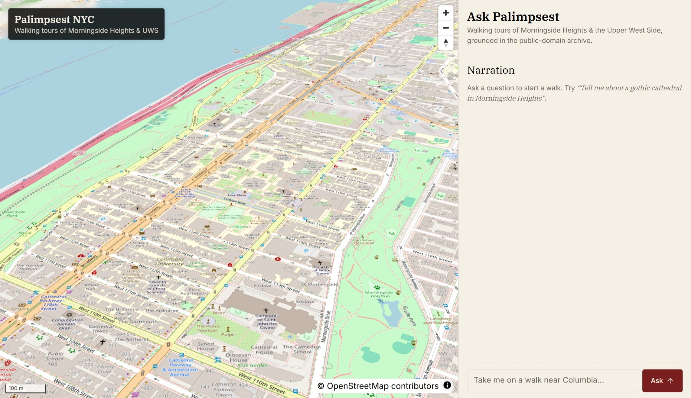

# Palimpsest NYC

[](LICENSE)

> An agentic LLM walking tour of Morningside Heights & the Upper West Side, grounded in public-domain archives, rendered in 3D.



*The "Ask Palimpsest" panel on the right streams a citation-grounded narration over Server-Sent Events while the map flies between cited places on the left.*

Palimpsest plans a short walking tour for a bounded slice of NYC and narrates it from free, public-domain sources — Wikipedia/Wikidata and OpenStreetMap. Every claim the agent makes is cited under a strict five-field contract that is verified at generation time, so the narration cannot reference a place the agent did not actually retrieve.

The bounded slice is by design: the corpus covers roughly 5km² around Morningside Heights and the Upper West Side, populated from Wikipedia, Wikidata, and the OSM Overpass API. Within that footprint the agent runs a single-tool retrieval loop with a hard 6-turn cap, a JSON terminal contract, and one corrective retry. The loop's narrowness is what makes the citation guarantees enforceable.

## Features

The four properties below are design constraints, not aspirational goals — they are enforced in code:

- Plans short walking tours from a free, public-domain archive (Wikipedia/Wikidata + OpenStreetMap).
- Single-tool agentic loop with a hard turn cap and a JSON terminal contract.
- Every claim cited under a strict five-field contract, verified at generation time.
- Server-streamed via SSE; the map renders the route with `flyTo` as citations arrive.

## Quickstart

Prereqs: Docker (with `compose` v2), `uv` (or Python 3.12 + `venv`), Node 20+. You will need an `OPENROUTER_API_KEY`.

Bring up the full stack — Postgres + PostGIS + pgvector, Redis, the FastAPI API, the heartbeat worker, and the React web app — with a single command:

```bash
# 1. configure environment
cp .env.example .env
# edit .env to set OPENROUTER_API_KEY

# 2. bring the stack up
make up

# 3. follow logs
make logs

# 4. hit the health check
curl http://localhost:8000/health
# → {"status":"ok"}

# 5. open the frontend
open http://localhost:5173
```

To stop everything: `make down`.

Note: schema changes require `make nuke && make up`, because the schema is owned by `apps/api/app/db/migrations/*.sql` and is applied by the postgres entrypoint on first volume init. ORM `create_all` is never used in app code paths.

## Try the agent

Once the stack is up, populate the corpus once and ask the agent a walking-tour question:

```bash
# 1. populate the 5km² Morningside Heights + UWS corpus (~30s total)
docker compose exec api python -m app.ingest.cli osm run
docker compose exec api python -m app.ingest.cli wikipedia run

# 2. ask the agent a question; watch SSE events stream live
curl -N "http://localhost:8000/agent/ask?q=Tell+me+about+a+gothic+cathedral+in+Morningside+Heights"
```

Re-running ingestion is idempotent — rows are upserted by their stable provenance keys.

The SSE stream emits the following frames in order:

| event | when |
|---|---|
| `turn` | each LLM turn boundary |
| `tool_call` | the agent invokes `search_places` |
| `tool_result` | matched documents come back from postgres |
| `tool_error` | a tool invocation raised — the loop continues with the error fed back to the LLM |
| `narration` | terminal JSON payload with the prose |
| `citations` | terminal JSON payload with the cited documents |
| `warning` | non-fatal verifier warning (e.g. citation retry exhausted with `verified=False`) |
| `walk` | server-side `plan_walk` over the cited place IDs |
| `done` | terminal marker after walk planning |

## How it works

The agent runs as a streamed multi-turn loop:

1. **Question in.** The user question hits `/agent/ask` over SSE.
2. **Search.** The agent dispatches `search_places` calls against a postgres+pgvector corpus, blending vector similarity (384-dim `bge-small`) with `pg_trgm` text search.
3. **Terminate.** Within a hard cap of 6 turns the loop emits a JSON terminal response: `{narration, citations[]}` under a strict five-field contract (`doc_id`, `source_url`, `source_type`, `span`, `retrieval_turn`).
4. **Verify.** A retrieval ledger checks every citation against documents actually returned in the conversation; one corrective retry on failure.
5. **Plan walk.** A server-side `plan_walk` step orders the cited place IDs into a route with leg distances.
6. **Stream to client.** Each stage emits an SSE frame; the React client renders narration and triggers `flyTo` on the map as frames arrive.

The loop is intentionally narrow: exactly one tool, exactly one terminal response shape, no branching after citations are verified. That narrowness is what makes each invariant easy to test in isolation and easy to reason about when something fails.

For the architecture diagram and the agent loop deep-dive, see [`docs/project-overview.md`](docs/project-overview.md) and [`docs/agent-2026-04-28.md`](docs/agent-2026-04-28.md).

## Tech stack

The stack splits into four layers; each was chosen so v2 can swap one piece without touching the others:

- **Backend:** FastAPI · Python 3.12 · async SQLAlchemy + asyncpg · PostgreSQL 16 + PostGIS + pgvector + pg_trgm · Redis.
- **Frontend:** React + Vite + TypeScript · MapLibre GL (3D OSM, swap-ready for Google Photorealistic 3D Tiles).
- **LLM routing:** OpenRouter, behind a two-tier router with circuit breakers; on-device endpoint is a v2 swap-in.
- **Embeddings:** `BAAI/bge-small-en-v1.5` (CPU, 384-dim singleton on `app.state`).

## Project layout

Three apps under `apps/`, plus an OpenSpec workflow at the root. Each app has its own Dockerfile and runs independently in `docker-compose.yml`:

- **`apps/api`** — FastAPI backend.

  Hosts `/agent/ask` (SSE), `/llm/chat`, the agent loop, the citation verifier, the walk planner, and the `python -m app.ingest.cli` ingestion CLI.

- **`apps/web`** — React + Vite + TypeScript SPA.

  MapLibre GL is the default map engine; the `MapEngine` interface keeps Google Photorealistic 3D Tiles a swap-in away.

- **`apps/worker`** — heartbeat-only in V1.

  Same image as `apps/api`. The topology exists so v2 can drop in a scheduler without rebuilding.

- **`openspec/`** — spec-driven change proposals.

  Active change is `initial-palimpsest-scaffold`; locked V1 decisions live in `swap-llm-tiers-and-lock-mvp-decisions`.

## Roadmap

V1 ships the smallest end-to-end system that answers a citation-grounded walking-tour question. V2 widens the data sources and adds deployment surface:

**V1 — shipped:**

- Monorepo + docker-compose
- FastAPI skeleton + two-tier LLM router with circuit breakers
- DB schema + embeddings (PostGIS + pgvector + pg_trgm; 384-dim)
- Wikipedia + OSM ingestion (928 places, 323 documents)
- Single-tool agent + five-field citation verifier + server-side walk planner
- SSE endpoint, frontend EventSource consumer, map markers + `flyTo`
- Per-session telemetry harness for cost / cycle-time / failure-mode analysis

**V2 — planned:**

- On-device LLM endpoint via the same env-driven router tier
- Live data sources: Chronicling America, NYPL, NYC Open Data, MTA, NOAA
- VPS deploy + scheduler in `apps/worker`

## Further reading

The deep-dives below are dated snapshots — each describes the system as of the date in the filename.

- [`docs/project-overview.md`](docs/project-overview.md) — full project context, architecture, status snapshot, locked design decisions.
- [`docs/agent-2026-04-28.md`](docs/agent-2026-04-28.md) — agent loop, citation verifier, SSE endpoint.
- [`docs/db-and-embeddings-2026-04-28.md`](docs/db-and-embeddings-2026-04-28.md) — schema + ORM + embedder.
- [`docs/ingestion-2026-04-28.md`](docs/ingestion-2026-04-28.md) — Wikipedia + OSM ingestion.
- [`docs/swap-llm-tiers-2026-04-28.md`](docs/swap-llm-tiers-2026-04-28.md) — V1 MVP lock-down (LLM router rename, embedding model, citation contract, license).
- [`openspec/changes/initial-palimpsest-scaffold/`](openspec/changes/initial-palimpsest-scaffold/) — active OpenSpec change.

## License

Code is MIT — see [`LICENSE`](LICENSE). Data sources are public-domain or open-licensed; the full table lives in [`docs/project-overview.md`](docs/project-overview.md).
