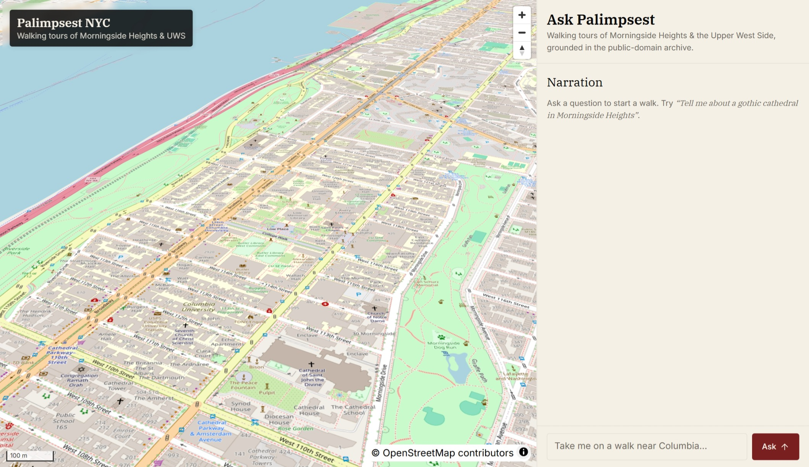

# Palimpsest NYC

[](LICENSE)

> An agentic LLM walking tour of Morningside Heights & the Upper West Side, grounded in public-domain archives, rendered in 3D.



*The "Ask Palimpsest" panel on the right streams a citation-grounded narration over Server-Sent Events while the map flies between cited places on the left.*

Palimpsest plans a short walking tour for a bounded slice of NYC and narrates it from free, public-domain sources: Wikipedia/Wikidata and OpenStreetMap. Every claim the agent makes is cited under a strict five-field contract that is verified at generation time, so the narration cannot reference a place the agent did not actually retrieve.

The bounded slice is by design: the corpus covers roughly 5km² around Morningside Heights and the Upper West Side, populated from Wikipedia, Wikidata, and the OSM Overpass API. Within that footprint the agent runs a single-tool retrieval loop with a hard 6-turn cap, a JSON terminal contract, and one corrective retry. The loop's narrowness is what makes the citation guarantees enforceable.

## Features

The four properties below are enforced in code, not aspirational:

- Plans short walking tours from a free, public-domain archive (Wikipedia/Wikidata + OpenStreetMap).
- Single-tool agentic loop with a hard turn cap and a JSON terminal contract.
- Every claim cited under a strict five-field contract, verified at generation time.
- Server-streamed via SSE; the map renders the route with `flyTo` as citations arrive.

## Quickstart

This runs the full project on your machine using the prebuilt Docker images. Nothing on your host except Docker itself.

Docker bundles each service and its dependencies into an image. The compose file in this repo describes five such services (postgres, redis, api, worker, web) and the network they share, and brings them all up with one command.

### Prerequisites

- **Docker** with the `compose` v2 plugin. On macOS or Windows, install [Docker Desktop](https://www.docker.com/products/docker-desktop/). On Linux, install [Docker Engine](https://docs.docker.com/engine/install/) and confirm `docker compose version` works.
- **An OpenRouter API key** from [openrouter.ai/keys](https://openrouter.ai/keys). The default models the project uses are on the free tier.
- About **2 GB of free disk** for the images and the corpus.

### 1. Get the deployment files

You need the repo's `docker-compose.prod.yml` and `.env.example`. Cloning is the simplest way:

```bash
git clone https://github.com/nyavana/Palimpsest-NYC.git
cd Palimpsest-NYC
```

If you'd rather not clone, download just those two files from the repo into a fresh directory.

### 2. Set your API key

```bash
cp .env.example .env
# open .env in any editor and set OPENROUTER_API_KEY=sk-or-v1-...
```

`.env` stays on your machine; it never enters the Docker images. On a shared host, run `chmod 600 .env` so only your user can read it.

### 3. Pull the images

```bash
docker compose -f docker-compose.prod.yml pull
```

This downloads three Palimpsest images (`api`, `web`, `postgres`) from `ghcr.io/nyavana/palimpsest-*` plus the public `redis:7-alpine` image. About 1 GB total. The first pull takes a couple of minutes; later pulls only fetch the layers that changed.

### 4. Start everything

```bash
docker compose -f docker-compose.prod.yml up -d
```

`-d` runs the stack detached (in the background). Compose starts services in dependency order: postgres and redis become healthy first, then api and worker, then web. The first start downloads the `BAAI/bge-small-en-v1.5` embedding model (~130 MB) into a named volume, which adds about a minute one time.

### 5. Verify it's up

```bash
docker compose -f docker-compose.prod.yml ps
```

Every service should report `Up` and `(healthy)`. Then:

```bash
curl http://localhost:8000/health
# {"status":"ok","version":"0.1.0"}
```

Open [http://localhost:5173](http://localhost:5173) in a browser. The UI loads, but the agent has nothing to talk about until you populate the corpus.

### 6. Populate the corpus (one-time, ~30 seconds)

```bash
docker compose -f docker-compose.prod.yml exec api python -m app.ingest.cli osm run
docker compose -f docker-compose.prod.yml exec api python -m app.ingest.cli wikipedia run
```

`docker compose ... exec api ...` runs a command inside the already-running api container. Both ingestors are idempotent — re-running them won't create duplicates. After this you should have 928 places and 323 documents in postgres, all embedded.

You're done. Ask the agent something through the web UI, or skip ahead to [Try the agent](#try-the-agent) for a `curl` example and the SSE event format.

## Day-to-day operations

All commands run from the repo root with the same `-f docker-compose.prod.yml` flag.

**Tail logs.** Live, last 100 lines, all services:

```bash
docker compose -f docker-compose.prod.yml logs -f --tail 100
```

For a single service add the name: `... logs -f api`.

**Stop without losing data.**

```bash
docker compose -f docker-compose.prod.yml down
```

The corpus, embeddings cache, and redis state live in named volumes (`palimpsest-postgres-data`, `palimpsest-hf-cache`, `palimpsest-redis-data`). Bring everything back with `up -d`.

**Update to a newer release.**

```bash
git pull
docker compose -f docker-compose.prod.yml pull
docker compose -f docker-compose.prod.yml up -d
```

`up -d` recreates only the containers whose images changed.

**Pin a specific version.** The default tag is `latest` (tracks `main`). For a deployment you want to be reproducible, pin to a semver tag:

```bash
PALIMPSEST_TAG=v0.1.0 docker compose -f docker-compose.prod.yml pull
PALIMPSEST_TAG=v0.1.0 docker compose -f docker-compose.prod.yml up -d
```

Tag the variable in your shell or `.env` so every command picks it up.

**Open a shell inside a container.**

```bash
docker compose -f docker-compose.prod.yml exec api bash
docker compose -f docker-compose.prod.yml exec postgres psql -U palimpsest -d palimpsest
```

**Wipe everything (drops the corpus too).**

```bash
docker compose -f docker-compose.prod.yml down -v
```

You will need to re-run the ingestion CLIs after this.

## What's in the published images

| Image | Purpose |
|---|---|
| `ghcr.io/nyavana/palimpsest-api` | FastAPI backend, agent loop, ingestion CLI. The worker reuses this image with a different command. |
| `ghcr.io/nyavana/palimpsest-web` | React SPA built into nginx. Routes `/api/*` to the api service over the compose network. |
| `ghcr.io/nyavana/palimpsest-postgres` | PostGIS 16 + pgvector + pg_trgm, with the V1 migrations baked into `/docker-entrypoint-initdb.d`. |

Tags: `latest` tracks `main`; semver tags (`v0.1.0`, `0.1`) come from git tags. The api image is around 760 MB uncompressed — `torch` is pulled from the CPU-only PyTorch index, so none of the CUDA payload is along for the ride.

The OpenRouter key is read from your host's `.env` at container start; it never enters the image. The published images have been audited for `.env` files and OpenRouter key signatures and are clean.

> **Note on routing.** `docker-compose.prod.yml` does not currently include the `osrm` / `osrm-prepare` services, so published-image deployments fall back to haversine straight-line walks (the `plan_walk` tool returns `routing_backend="haversine_fallback"`). To get street-following routes in a deployed environment, add the OSRM services or build from source — see [`infra/osrm/README.md`](infra/osrm/README.md). Wiring OSRM into the prod compose is a tracked V2 item.

## Build from source

If you want to develop against the project rather than just run it, build the stack locally with `make up`. This needs Docker plus `uv` (or Python 3.12 + `venv`) and Node 20+ on the host.

```bash
cp .env.example .env
make up        # build and start
make logs      # tail container logs
curl http://localhost:8000/health
open http://localhost:5173
```

Stop with `make down`, or `make nuke` to drop the volumes too. Schema changes require `make nuke && make up`, because the schema is owned by `apps/api/app/db/migrations/*.sql` and is applied by the postgres entrypoint on first volume init. ORM `create_all` is never used in app code paths.

### Routing graph (OSRM)

The agent's `plan_walk` tool calls an in-network OSRM service for street-following walking routes. Two compose services back this:

- **`osrm-prepare`** — one-shot. On first start it runs `osrm-extract -p foot.lua && osrm-partition && osrm-customize` against the OSM extract at `infra/osrm/extract.osm.pbf` and writes the prepared graph to a named volume. Idempotent: skips on subsequent boots once `extract.osrm.cnbg` is present.
- **`osrm`** — runtime. Serves `http://osrm:5000` on the compose network using `osrm-routed --algorithm mld` against the prepared graph. The image is pinned to `osrm/osrm-backend:v5.25.0`.

The OSM extract is **not committed** (it's ~100 MB and changes upstream). On a fresh checkout you need to drop a `.osm.pbf` for the V1 bbox at `infra/osrm/extract.osm.pbf` before `make up`. The full refresh procedure (BBBike URL, Geofabrik clip with `osmium`, idempotency rules, expected file sizes, smoke test) is in [`infra/osrm/README.md`](infra/osrm/README.md).

If `osrm` is unreachable at request time, `plan_walk` falls back to a haversine straight-line route with `routing_backend="haversine_fallback"` rather than failing the request — the frontend renders this as a dashed muted path.

## Try the agent

With the stack up and the corpus populated (Quickstart step 6), ask the agent a walking-tour question over SSE:

```bash
curl -N "http://localhost:8000/agent/ask?q=Tell+me+about+a+gothic+cathedral+in+Morningside+Heights"
```

If you built from source, the same URL works (the dev compose exposes the api on port 8000 too).

The SSE stream emits the following frames in order:

| event | when |
|---|---|
| `turn` | each LLM turn boundary |
| `tool_call` | the agent invokes `search_places` or `plan_walk` |
| `tool_result` | matched documents (or a routed walk) come back |
| `tool_error` | a tool invocation raised; the loop continues with the error fed back to the LLM |
| `narration` | terminal JSON payload with the prose |
| `citations` | terminal JSON payload with the cited documents |
| `warning` | non-fatal verifier warning (e.g. citation retry exhausted with `verified=False`) |
| `walk` | emitted only when the agent called `plan_walk` (street-following GeoJSON LineString + per-leg turn-by-turn) |
| `done` | terminal marker |

## How it works

The agent runs as a streamed multi-turn loop:

1. **Question in.** The user question hits `/agent/ask` over SSE.
2. **Search.** The agent dispatches `search_places` calls against a postgres+pgvector corpus, blending vector similarity (384-dim `bge-small`) with `pg_trgm` text search.
3. **(Optional) Plan a walk.** For tour-style queries the agent calls `plan_walk` against an OSRM-backed routing service to convert cited place IDs into a street-following walking route with per-leg turn-by-turn instructions. A walk-intent classifier nudges the system prompt; the LLM still decides whether to call.
4. **Terminate.** Within a hard cap of 7 turns the loop emits a JSON terminal response: `{narration, citations[]}` under a strict five-field contract (`doc_id`, `source_url`, `source_type`, `span`, `retrieval_turn`).
5. **Verify.** A retrieval ledger checks every citation against documents actually returned in the conversation; one corrective retry on failure.
6. **Stream to client.** Each stage emits an SSE frame; the React client renders narration, triggers `flyTo` as citations arrive, and draws the OSRM walk geometry as a polyline if the agent produced one.

The loop is intentionally narrow: two tools, one terminal response shape, and no branching once citations are verified. That keeps each invariant easy to test in isolation and easy to reason about when something fails.

For the architecture diagram and the agent loop deep-dive, see [`docs/project-overview.md`](docs/project-overview.md), [`docs/agent-2026-04-28.md`](docs/agent-2026-04-28.md), and [`docs/route-planning-2026-05-04.md`](docs/route-planning-2026-05-04.md).

## Tech stack

The stack splits into four layers; each was chosen so v2 can swap one piece without touching the others:

- **Backend:** FastAPI · Python 3.12 · async SQLAlchemy + asyncpg · PostgreSQL 16 + PostGIS + pgvector + pg_trgm · Redis · OSRM (foot profile) for street-following walking routes.
- **Frontend:** React + Vite + TypeScript · MapLibre GL (3D OSM, swap-ready for Google Photorealistic 3D Tiles).
- **LLM routing:** OpenRouter, behind a two-tier router with circuit breakers; on-device endpoint is a v2 swap-in.
- **Embeddings:** `BAAI/bge-small-en-v1.5` (CPU, 384-dim singleton on `app.state`).

## Project layout

Three apps under `apps/`, plus an OpenSpec workflow at the root. Each app has its own Dockerfile and runs independently in `docker-compose.yml`:

- **`apps/api`**: FastAPI backend.

  Hosts `/agent/ask` (SSE), `/llm/chat`, the agent loop, the citation verifier, the walk planner, and the `python -m app.ingest.cli` ingestion CLI.

- **`apps/web`**: React + Vite + TypeScript SPA.

  MapLibre GL is the default map engine; the `MapEngine` interface keeps Google Photorealistic 3D Tiles a swap-in away.

- **`apps/worker`**: heartbeat-only in V1.

  Same image as `apps/api`. The topology exists so v2 can drop in a scheduler without rebuilding.

- **`openspec/`**: spec-driven change proposals.

  Active change is `initial-palimpsest-scaffold`; locked V1 decisions live in `swap-llm-tiers-and-lock-mvp-decisions`.

## Roadmap

V1 ships the smallest end-to-end system that answers a citation-grounded walking-tour question. V2 widens the data sources and adds deployment surface:

**V1, shipped:**

- Monorepo + docker-compose
- FastAPI skeleton + two-tier LLM router with circuit breakers
- DB schema + embeddings (PostGIS + pgvector + pg_trgm; 384-dim)
- Wikipedia + OSM ingestion (928 places, 323 documents)
- Two-tool agent (`search_places`, `plan_walk`) + five-field citation verifier + OSRM-backed routing + walk-intent soft hint
- SSE endpoint, frontend EventSource consumer, map markers + `flyTo`
- Per-session telemetry harness for cost / cycle-time / failure-mode analysis
- Docker images published to ghcr.io on every `main` push and on `v*` tags, pulled by `docker-compose.prod.yml`

**V2, planned:**

- On-device LLM endpoint via the same env-driven router tier
- Live data sources: Chronicling America, NYPL, NYC Open Data, MTA, NOAA
- Hosted demo (VPS or PaaS) and a scheduler in `apps/worker`

## Further reading

The deep-dives below are dated snapshots; each describes the system as of the date in the filename.

- [`docs/project-overview.md`](docs/project-overview.md): full project context, architecture, status snapshot, locked design decisions.
- [`docs/agent-2026-04-28.md`](docs/agent-2026-04-28.md): agent loop, citation verifier, SSE endpoint.
- [`docs/db-and-embeddings-2026-04-28.md`](docs/db-and-embeddings-2026-04-28.md): schema + ORM + embedder.
- [`docs/ingestion-2026-04-28.md`](docs/ingestion-2026-04-28.md): Wikipedia + OSM ingestion.
- [`docs/swap-llm-tiers-2026-04-28.md`](docs/swap-llm-tiers-2026-04-28.md): V1 MVP lock-down (LLM router rename, embedding model, citation contract, license).
- [`openspec/changes/initial-palimpsest-scaffold/`](openspec/changes/initial-palimpsest-scaffold/): active OpenSpec change.

## License

Code is MIT — see [`LICENSE`](LICENSE). Data sources are public-domain or open-licensed; the full table lives in [`docs/project-overview.md`](docs/project-overview.md).
