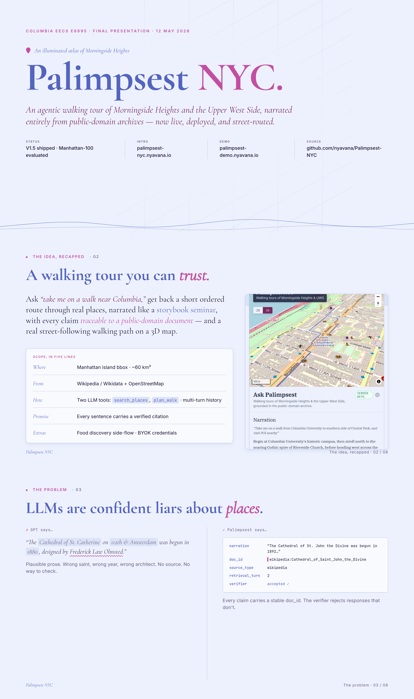
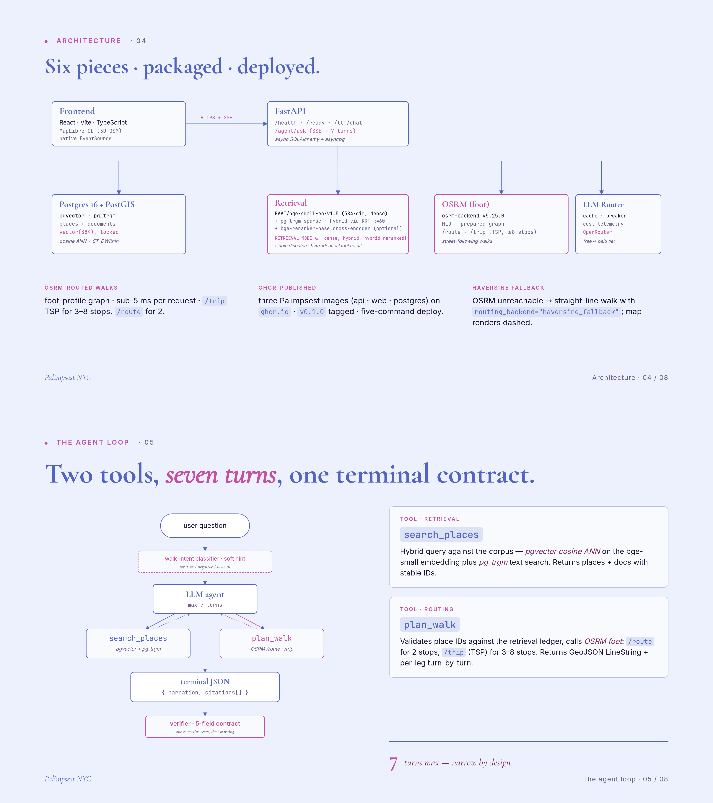
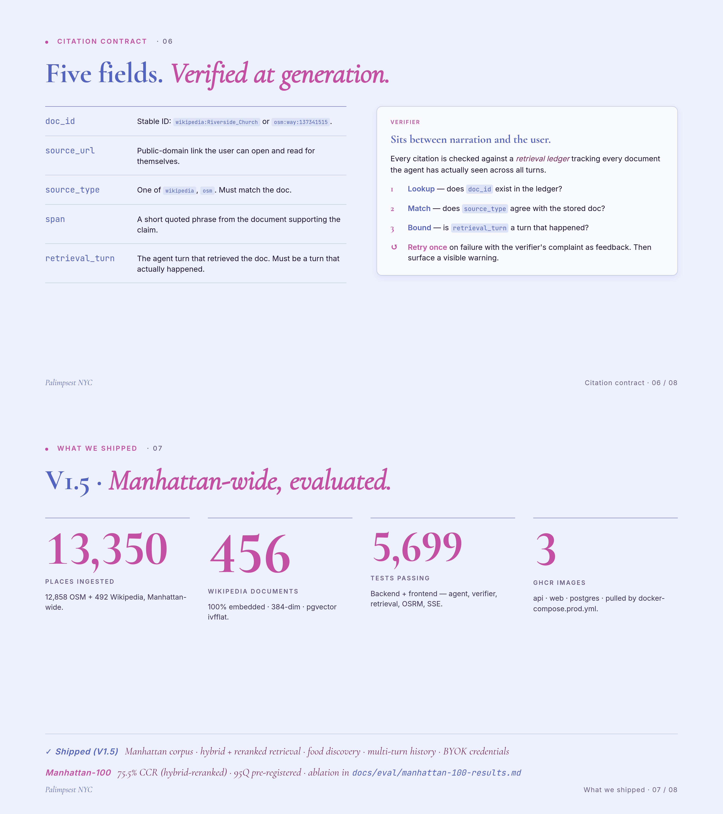

# Palimpsest NYC

[](LICENSE)
[](https://github.com/nyavana/Palimpsest-NYC/pkgs/container/palimpsest-api)
[](https://www.python.org/)
[](https://palimpsest-demo.nyavana.io/)

> **Agentic walking tours of Manhattan, narrated from open data, with every claim cited.**



Palimpsest plans a short walking tour of Manhattan and narrates it from free, public-domain sources — Wikipedia, Wikidata, and OpenStreetMap. Every claim is grounded in retrieved documents under a strict five-field citation contract that the system verifies before streaming the response, so the narration cannot reference a place the agent did not actually retrieve.

## Links

- 🌐 **Project site** — <https://palimpsest-nyc.nyavana.io/>
- 🎮 **Live demo** — <https://palimpsest-demo.nyavana.io/>
- 📦 **Container images** — `ghcr.io/nyavana/palimpsest-{api,web,postgres}`
- 📄 **License** — [MIT](LICENSE)

## Features

- **Citation-grounded walking tours.** Every fact in the narration is tied to a retrieved document under a strict five-field contract (`doc_id`, `source_url`, `source_type`, `span`, `retrieval_turn`), checked against a retrieval ledger before the response leaves the server.
- **Manhattan-wide POI corpus.** ~13,350 places — 12,858 OpenStreetMap features and 492 Wikipedia/Wikidata entries — ingested, embedded, and queryable out of the box.
- **Hybrid retrieval.** Switch between dense (`bge-small`, 384-dim), hybrid (dense + `pg_trgm` name similarity fused with RRF), and hybrid + cross-encoder reranker (`bge-reranker-base`) modes via a single env var.
- **Two-tool agent loop.** A bounded loop (hard 6-turn cap, JSON terminal contract) where the LLM picks between `search_places` (retrieval) and `plan_walk` (OSRM-backed routing + along-route POI discovery).
- **Server-sent streaming.** SSE frames for turn, tool-call, tool-result, narration, citations, and the routed walk — the map flies between places as the response unfolds.
- **Food discovery side flow.** Ask for coffee, lunch, or dessert nearby; get a structured candidate list with hybrid lexical + vector ranking, choose one, and continue the tour.
- **Bring your own key.** Leave the operator key blank and visitors authenticate with their own OpenRouter (or any OpenAI-compatible) credentials via the in-app Settings panel — held only in browser `sessionStorage`.

## Architecture



A user's question hits the FastAPI backend over SSE and enters a bounded agent loop. Each turn the LLM chooses between `search_places` (hybrid retrieval over PostGIS + pgvector + pg_trgm, optionally reranked) and `plan_walk` (an OSRM foot-profile router that auto-discovers POIs along the route). The loop terminates with a JSON payload of narration text and verified citations; the React frontend streams the narration, draws the route as a polyline, and triggers MapLibre `flyTo` as citations arrive on the wire.

**Stack:**

- **Backend** — FastAPI · Python 3.12 · async SQLAlchemy + asyncpg
- **Data** — PostgreSQL 16 + PostGIS + pgvector + pg_trgm · Redis · OSRM (foot profile)
- **LLM** — OpenRouter behind a two-tier router with per-tier circuit breakers
- **Embeddings** — `BAAI/bge-small-en-v1.5` (384-dim, CPU)
- **Reranker (optional)** — `BAAI/bge-reranker-base` cross-encoder
- **Frontend** — React · Vite · TypeScript · MapLibre GL · Tailwind

## Results



Evaluated on **Manhattan-100**, a pre-registered benchmark of 95 graded questions (tag `eval/manhattan-100-v1`), judged by an LLM rubric (Citation-Correct Rate, Hallucination Rate, Numerical Quality, Graceful Refusal Rate).

| System | Citation-Correct Rate (CCR) |
|---|---:|
| Vanilla LLM, no retrieval | **6.8%** |
| Palimpsest — dense retrieval | 72.5% |
| Palimpsest — hybrid retrieval | 75.1% |
| **Palimpsest — hybrid + reranker** | **75.5%** |
| Naive RAG (top-k dump into prompt) | 85.6% † |

† Naive RAG looks higher because it dumps the entire top-k retrieval into the prompt, so almost every cited `doc_id` is present in `retrieved_docs` by construction; Palimpsest's agent calls retrieval as a tool and cites a smaller, more targeted set per turn.

Full ablation, per-region / per-source breakdowns, accuracy-vs-latency Pareto, and methodology caveats: [`docs/eval/manhattan-100-results.md`](docs/eval/manhattan-100-results.md).

## Getting started

Run the full stack from the published images in four commands. Requires Docker with the `compose` v2 plugin and ~2 GB of free disk.

```bash
git clone https://github.com/nyavana/Palimpsest-NYC.git
cd Palimpsest-NYC
cp .env.example .env                                # set OPENROUTER_API_KEY, or leave blank for BYOK
docker compose -f docker-compose.prod.yml up -d
```

Then open <http://localhost:5173>.

The first start downloads the `bge-small-en-v1.5` embedding weights (~130 MB) into a named volume; subsequent starts skip this. After the stack is healthy, populate the corpus once:

```bash
docker compose -f docker-compose.prod.yml exec api python -m app.ingest.cli osm run
docker compose -f docker-compose.prod.yml exec api python -m app.ingest.cli wikipedia run
```

For environment variables, image pinning (`PALIMPSEST_TAG=v0.1.0`), building from source, day-to-day operations, and troubleshooting, see [**docs/deployment.md**](docs/deployment.md).

## API at a glance

Stream a walking-tour answer over SSE:

```bash
curl -N -X POST -H "Content-Type: application/json" \
  -d '{"q":"Tell me about a gothic cathedral in Morningside Heights"}' \
  http://localhost:8000/agent/ask
```

The response is an SSE stream of `turn → tool_call → tool_result → narration → citations → [walk?] → done` frames.

In BYOK mode (operator key blank), pass the user's credentials in the `X-LLM-Credentials` header as base64-encoded JSON:

```bash
HEADER=$(printf '%s' '{"api_key":"sk-or-v1-...","model":"openai/gpt-5.4-mini"}' | base64 -w0)
curl -N -X POST -H "Content-Type: application/json" -H "X-LLM-Credentials: $HEADER" \
  -d '{"q":"..."}' http://localhost:8000/agent/ask
```

Food discovery (structured candidate list, not the streaming agent):

```bash
curl -X POST -H "Content-Type: application/json" \
  -d '{"q":"coffee near Columbia"}' \
  http://localhost:8000/food/discover
```

## Documentation

- [Deployment guide](docs/deployment.md) — env vars, image pinning, build from source, operations, troubleshooting
- [Project overview](docs/project-overview.md) — architecture, design decisions, data sources
- [Evaluation results](docs/eval/manhattan-100-results.md) — Manhattan-100 ablation and methodology
- [Food discovery flow](docs/food-discovery/README.md) — design rationale and chat-pane intent routing
- [Legacy README](docs/README-legacy.md) — the original research-flavored README, preserved verbatim

## Acknowledgements

Built on open data and open models:

- [OpenStreetMap](https://www.openstreetmap.org/) © contributors, [ODbL](https://opendatacommons.org/licenses/odbl/)
- [Wikipedia](https://www.wikipedia.org/) and [Wikidata](https://www.wikidata.org/) under [CC BY-SA](https://creativecommons.org/licenses/by-sa/4.0/)
- [OSRM](https://project-osrm.org/) for street-following walking routes
- [BAAI BGE](https://huggingface.co/BAAI) embedding and reranker models
- [OpenRouter](https://openrouter.ai/) for LLM inference
- [MapLibre GL](https://maplibre.org/) for the in-browser map renderer

## License

[MIT](LICENSE).
